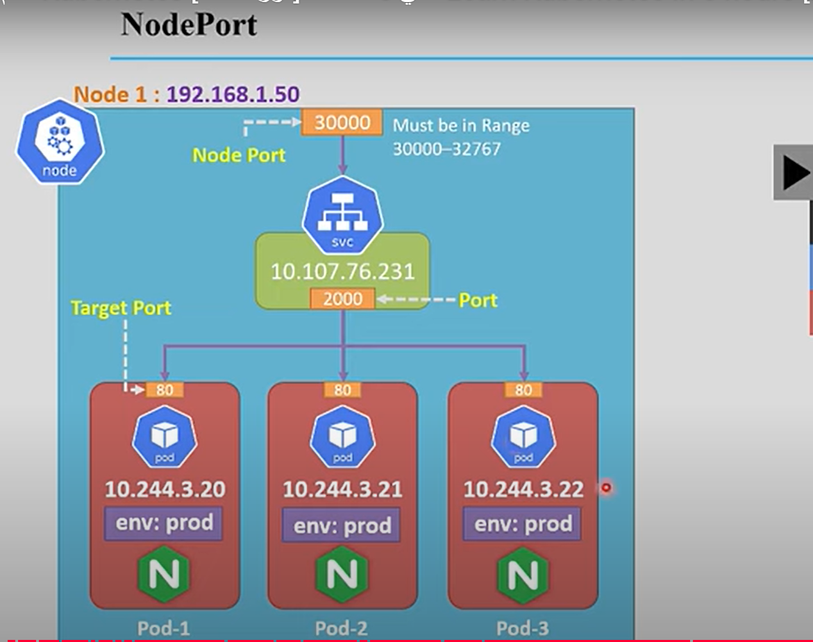

# مقدمة سريعة

* يتكون من :
  * worker and manager nodes 
  ## Manager node 
  وظيفته اﻷساسية هي الإعدادات الخاصة بالكلاستر 
### API server 
* بداخله الكثير من المكونات
* هو المسؤل عن التواصل داخل الكلاستر وخارجها 
* حينما يقوم المبرمج بإرسال بعض الإعدادات فإنه يقوم بإرسالها من خلال الترمنال 
* تفهم الترمنال أنها لا بد لها أن تتواصل مع ال api server 
* قوم بارسال الطلب إليه ثم يقوم هوا بارسال الطلب سواء داخل ال ماستر او الى الوركر
* المكونات داخل الماستر لا مكنها أن تتحدث مع بعضها مباشرة وإنما من خلال الوركر 
* يمكنك أن تتكلم معه بأكثر من طريقة مثل :
1. command line (kubectl)
2. Dashboard (ليس اﻷفضل )
3. API interface 
   1. Python
   2. Java
   3. curl
### etcd
* هي قاعدة البيانات التي بها جميع الإعدادات الخاصة بال cluster
* key value DB
* high available 
* k8 can be backup from it 
### schduler 
* it is responsible to create dyployment like pods 
* schduling the pods on worker node 
### controller manager 
* مسؤلة أن تقارن الحالة الحلية بالحالة المرغوبة 
  * current status to desired status
* monitor the components stats in the cluster 
### cloud-controller manager 
* responsiple for connection with cloud proovider 
    ## Worker node
    وظيفته اﻷساسية هي تشغيل الأبلكيشن كونتينر  
### kubelet
  * هوا الذي يقوم بالتحدث مع المانجر كومبوننت مثل API server  
  * it is agent receive the request from api server and redirect it the other component
  * monitor the healthy of the pods 
  * send a report to the api server of every pod status 
### Container runtime
  * create the pod  based on the instruction comming from the kublet 
  * it has many types like : 
    * docker 
    * cri-o
    * containerd
### kube proxy 
  * هو المسؤل عن كل ما يمت للنتورك بصلة  
  * connection between the pods in the same clusters and in different cluster 

    # Installation
* يمكنك تصطيب كوبرناتس بأكثر من طريقة
  * multinodes (manger and workers node not on the same machine) (Kubeadm)
    * cloud wiether on VM or native install 
  * تنزيل جميع المكونات على ماكينة واحدة (minikube) 
    * this can be done through minikube
    * this can be done on container or VM .
  * manger node can be installed only on linux till now .

* <span style="color:red;">K8 is not container runtime , K8 is not natively creating the containers , it is using something else like :</span> 
using something else like :
  *  docker runtime 
  *  Runc
  *  LXC

 ويمكنك تحديد أي منهم ليستخدمه والمفضل لديه هو دوكر 

### Donloading and install minikube on ubuntu
[minikube installation link for ubuntu](https://minikube.sigs.k8s.io/docs/start/?arch=%2Flinux%2Fx86-64%2Fstable%2Fbinary+download) 
### install kubectl 
```bash
snap install kubectl --classic
```
* <span style="color:red;"> both of them needs to be downloade on vm and you need to enable nested VM
 أيضا يمكنك عمل ذلك على جهاز لنكس مع عمل 
 الازم على أي هايبرفايزور 
</span>
```bash
VBoxManage modifyvm k8 --nested-hw-virt on
#the command suggested by deepsek but I do not need it 
minikube start
minikube start --driver virtualbox/docker
```
اﻷمر السابق قام بانشاء ماكنة على virtualbox 
VM name is minikube 

minikube status/start/restart/stop
kubectl cluster-info
give you the cluster IP 
minikube dashboard
it is one of addons provied by k8 

# dashboard fast look 
* name space is a logical grouping of component related to service or deplyment  
kubectl get nodes 
kubectl get nodes -o wide 
for more info 


# K8 arch requirements
1. HA (قبل الكارثة)
2. scalability
3. DR (بعد الكرثة)

# K8 arch details 
* الوحدة اﻷساسية لكوبرناتس هي البود وليس الدوكر 
* يحتوي البود على أكثر من كونتينر يمكن أن يكون لنفس الشيئ ويمكن أن يختلفا the same service or different 
* the deployment and replication will be on the pod level not on the container 
* the deployment is a group of pods 
  * abstraction layer
  * يتم فيه تحديد طريقة التحديث وعدد البود (number of replica and the update type )
  * it manges on or more replicasets .
  * images and many things 
* The service is a group of deployment
  * the deplyment is abstraction layer send the request to the available deployment and replicate it for HA 
  * the user can deal with service 
* ingres network load balse the requests to the services and it contains the DNS and user can deal with it 
* PV should known to persistat volume 
* config map relate the 
  * config map like DB
  * to avoid changing from oracle to mysql 
  

# sample deployment 
  ### kubectl basics
* The common format of a kubectl command is: 
```bash
kubectl action resource
or
kubectl command type name
```

* This performs the specified action (like create, describe or delete) on the specified resource (like node or deployment). You can use --help after the subcommand to get additional info about possible parameters (for example: kubectl get nodes --help).
* https://kubernetes.io/docs/tutorials/kubernetes-basics/deploy-app/deploy-intro/
* kubectl get all - kubectl get deployments 
## start the DP
* kubectl create deployment kubernetes-bootcamp --image=gcr.io/google-samples/kubernetes-bootcamp:v1
  * DP name = kubernetes-bootcamp
* kubectl proxy
  * بدأ البروكسي والذي يقوم بتشغيل كل ما له علاقة بالنتورك 

  * curl http://localhost:8001/api/v1/namespaces/default/pods/kubernetes-bootcamp-9bc58d867-d5pfj:8080/proxy/
    * curl هو أحد الأوامر التي يمكنها التحدث إلى ال control plane 
    * هذا اﻷمر يقوم بتنفيذ محتوى ال pods as client accessing the web
    * هذا اﻷمر يقوم بتوصيلنا للبود بشكل غير مباشر من خلال ال api server first
    * 8080 is the working port on the pod (webserver port)
    * every component in url starts with http://localhost:8001/api/namespace
    * namespace using the deafuld by deafault
    * 8001 the proxy port 

* curl http://localhost:8001/api/v1/namespaces/default/pods/kubernetes-bootcamp-9bc58d867-d5pfj
  * هذا اﻷمر يستعرض إعدادات ال pod
  


```bash
kubectl exec kubernetes-bootcamp-9bc58d867-d5pfj -- env
kubectl logs kubernetes-bootcamp-9bc58d867-d5pfj
kubectl exec -it kubernetes-bootcamp-9bc58d867-d5pfj -- bash
```
* اﻷمر اﻷوول لاستعراض متغيرات ال pods
* الثاني لاستعراض pod logs 
* الثالث للدخول الى البود والتعامل معها من الداخل ك VM

```bash
kubectl expose deployment/kubernetes-bootcamp --type="NodePort" --port 8080
```
* هذا اﻷمر يقوم بعرض البورت الخاصة بالبود 
* -type="NodePort"  يتم اختيار البورت عشوائيا 
```bash
kubectl describe service/kubernetes-bootcamp
kubectl api-resources
kubectl get pods --all-namespaces
```
* هذه اﻷوامر تساعدك على استكشاف الكلاستر 
```bash
curl $(minikube ip):30258
``` 
* 30258 this port is the service exposed port
note that the IP of minikube is different that the IP of service 

```bash
kubectl scale deployment/kubernetes-bootcamp --replicas=4
```
```bash
kubectl get nodes -o wide
kubectl get pods -o wide
```
```bash
kubectl set image deployment/kubernetes-bootcamp (put the desired image here)
```
* to delete everything in K8
```bash
kubectl delete deployments/services/pods --all
kubectl apply -f /home/hafez/Git/docs-repo/k8/deplooyment.yaml
```
* لمسح جميع الإعدادات وإعادتها مرة أخرى ولكن عن طريق ملف yaml

### Learning with dolfined
  ## K8 Yaml file 
* المسافات مهمة جدا وتكون عادتا هرمية , كما أن الحروف sinctive
* يجب أن يحتوي على 
1. apiversion (key , value)
   يتم اختيار النوع عن طريق ما اريد إنشاؤه 
   وهو أكثر من نوع على سبيل المثال لا الحصر  
   1. v1
      وله أكثر من object like :
      1. pod
      2. services 
      3. namespaces
   2. apps/v1
      1. deployment
      2. replicaset
   3. networking.k8.io/v1
      1. ingress
   4. storage.k8.io/v1
      1. storage class
   اول شئ في الملف هو تحديد نوع ال APIversion
  
2. kind (key , value)
  *  يتم فيه تحديد نوع ما يراد إنشاؤه , ويكون عادة مرتبط بالسطر الذي يسبقه وهو ال apiversion 
3. metadat (dectionary)
  *  معلومات زيادة عن ما أريد أنشاؤه وهو ال 
  * object or the pod for example
  * Names , selectors and namespaces are another examples
4. specfication (dectionary)
   * بداخلها مواصفات ما أريد أنشاؤه 
   * the image of the pod is an example 
1:16:18 schema of yaml edit in vscode 

```bash
kubectl api-resources 
kubectl explain pod
kubectl apply -f lab1.yaml
```
* اﻷمر اﻷول لمعرفة الريسسورسس الموجودة كلها المستخدمة والغير مستخدمة والثاني لتوضيح البود كشيئ وطريقة استخدامه في الملفات
### check lab1.yaml note that the litter is case sinsitev 
[the yaml configuration](k8/lab1.yaml)

## imparative and declarative
1. imprative
    تكون باستخدام اﻷوامر للإنشاء
2. declartive
    تقوم باستخدام الملفات التعريفية للإنشاء
* عند تعريف ملف ثم تشغيله فانه يضاف بعض اﻷشياء الهذا الملف 
* this fields is for runtime container 
* annotation field give you the last update on pod ef you changed the configuration using the imprative mode 
```bash
kubectl get pod -o yaml
```

# namespace
* هوا تجميع بعض المكونات في مكان واحد داخل الكلاستر وعزلهم عن باقي الكلاستر مثل البود resouces in general 
* يمكنك إنشاء أكثر من مساحة على نفس الكلاستر 
* اﻷسماء يجب أن تكون فريدة داخلها فقط وليس في كل الكلاستر أعني ال namespace 

### Kubernates initial namespaces
* هناك أربع مساحات موجودة مسبقا في الكلاستر ولا يمكن مسحها  
1. deafult
    *    هي المساحة الطبيعية لاي شيئ يتم إنشاؤه داخل الكلاستر ما لم يتم تعيين غير ذلك 
2. Kube-system
3. kube-public
4. kube-node-lease
```bash
kuebctl create namespace prod-hafez
kubectl get pods
kubectl get pods --namespace=prod
```
    * اﻷمر اﻷول واضح والثاني يبحث عن البودز التي بداخل ال deafult namespace
    اﻷمر الثالث واضح 
   kind: Namespace #to write namespace in yaml file
```bash
kubectl config set-context --current --namespace=prod-hafez
```
  * this command set that namespace to be the deafault one 
  * namepsace can be assigned at metadatat at the yaml file 
  * kubectl run pod-name --image=image-name -n namespace-name 
# replication controller and replcaset
* وظيفتهما اﻷساسية هي مراقبة البود حتى يقوما بإنشاء بديل في حالة تعطل البود
*  replicaset (RS) and replication controller (RC) are used for HA and Load balancing
*  RC and RS are the same concept but RC is the oldest 
### RS in yaml file 
* check the yaml file
* اسم البود الناتج عن هذا الملف يكون عبارة عن اسم RS-name+podename  
[the RS yaml configuration](k8/lab2.yaml)
### RS in cli 
```bash
kubectl get rs
kubectl describe rs rs-name
kubectl scale rs rs-name --replicas=5
```
### pod status 
* Waiting: Containers aren't running yet (e.g., pulling images, awaiting resources). Transient state before startup.
* Succeeded: All containers exited successfully (exit code 0). Common in completed jobs/tasks.
* Failed: At least one container crashed (non-zero exit). Requires debugging logs/events.
# deployments
* it manges the RS whish is responsible for monitoring the pods .
### yml filr for the deployment 
* check the yaml file 
[the Deloyment yaml configuration](k8/lab3.yaml)
* the Deplyment create the RS and the RS create the pods 
* the name of RS will be the name of Deployment+the name of RS
* The name of pod will be Deploy+RS+pod name . 
  - hafez-deploy - hafez-deploy-576ffcb87d - hafez-deploy-576ffcb87d-5q9sz
### Deplyment impartive 
```bash
kubectl create deployment deploy-name --image=nginx --rplicas=3
```
# services
* تكون عادة مرتبطة بالبودز التي تكون البرنامج وترتبط بهم عن طريق labels and selectors
* expose the application to external world 
* also allow different deployment connection within the same cluster 
* it has a fixed IP 
* Deployment monitor the pods and service allow connection to the pod
* It has many types :
1. ClusterIP
    * allow connection internally within the cluster 
    * It is the deafault service in K8
    * It has a fixed IP
    * It can not be accessed from the outside 
    * Imparative commands for services 
```bash
kubectl expose deployment deploy-name --port=5000 --target-port=80 # it creates a service 
kubectl get ssvc # get service
# example 
kubectl create deployment hafez-dp --mage-nginx --replica=2 --port=80
kubectl expose deployment hafez-dp --port=5000 --target-port=80

```
الكلام الاتي بحاجة الى التدقيق :
أول ما يتم انشاء السيرفيس تقوم بانشاء endpoint 
this endpoint compose from the pod ip and it's open port 80 for example , to make the connection with the service easy 
    * how to write yaml file for service 
      * check both files  [deployment](k8/lab3.yaml) and [service](k8/lab4-service.yaml)
```bash 
http://localhost:8001/api/v1/namespaces/default/services/hafez-service:5000/proxy/
http://localhost:8001/api/v1/namespaces/default/pods/hafez-deploy-576ffcb87d-2dnmm:80/proxy/
```
2. NodePort
* وظيفتها أنتجعل البرنامج او البود متصلا مع الخارج 
* if that port configured it will be configured on all nodes .
  
    * the request will go from external to Nodeport then (3000) then to the service , and then will be load balance to the all pods . 
* Nodeport range (30000-32767)
* يتم اختيار البورت عشوائيا إذا لم يتم تحديدها 
* targetpor = port if you did not assign the target port 
* [Nodeport yaml file config](k8/lab5-nodeport.yaml)
* Impartive command : 
```bash
kubectl expose deployment dep-name --type=NodePort --port=20000 --target-port=80 --name=hafez-nodeport
```

* 
* the service is a vertual component has IP and Port (2000) and can be accessed from the 2 nodes 
* تقوم بتوجيه الطلب الى جميع البودز حتى لو كانوا في نودز مختلفة
* if the connection comming from the outside you can use any IP (node1 or node2) with the Nodeport(3000) to access the app . 
* طريقة اﻷكسس تكون مختلفة بحسب طريقة التسطيب
  * minikube ip will be used if all in one machine
  * Nde IP and service IP will be used if we have many Nodes 
3. LoadBalancer 
   the LoadBalancer service type is used to expose a service externally, typically in cloud environments. It automatically provisions an external load balancer (e.g., AWS ELB, GCP Cloud Load Balancer, Azure Load Balancer) to distribute traffic across your pods.
4. ExternalName
   يشبه ال DNS
5. ingress
   هي ليست سيرفس , لكنها تشبهها  
