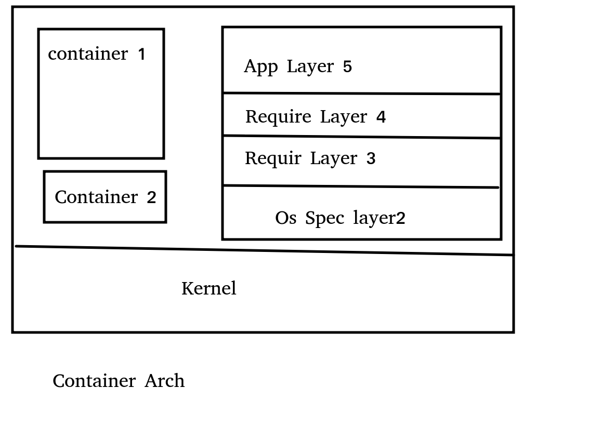

# VM abd Container Arch
* تتكون الماشين الوهمية كما هو موضح , مع اﻷخذ في الاعتبار ان طبقة نظام التشغيل تتكون من مكونين رئيسيين 

1. Kernel mode 
   يحتوي على مكونات الكرنل الرئيسية كالتعامل مع الهاردوير
2. User mode 
   يحتوي على المكونات التي تتغير من مستخدم الى اخر وعلى بعض السيرفي التي قد يحتاجها المستخدم وكلمات السر وغير ذلك 
* الأبلكيشن بحاجة الى الكرنل مود فقط لذلك يستخدمه الكونتينر فقط 
* على هذا اﻷساس تم الاستغناء عن الكثير من الطبقات التي لا حاجة لنا بها 
* 
  إذا قمت بعمل تبملت لماشين وهمية خاصة بموقع تم بناؤه على لنكس على سبيل المثال , وهذه التمبلت جاهزة لأن يتم إنشاء موقع منها فأن هذه التمبلت بما تشغله من مساحة تسمى  <span style="color:red;">Base Image or Base Disk</span>
* لكي تقوم بعمل الموقع من هذه التمبلت لديك طريقتان 
  1. machine.vhd : وهي أن تقوم بتخزين الصورة كلها والبناء عليها وهذا ليس اﻷفضل فإن كانت التمبلت 100 جيجا يصبح الموقع الجديد 100 جيجا أيضا
  2. machind.avhd : أن تقوم ببناء هذه الصورة بالإشارة ألى التمبلت الأصلية فإن كانت الصورة اﻷساسية 100 جيجا فإن الموقع الجديد يحتوى على الاختلاف فقط فم الممطن أن يكون 1 جيجا فقط وهذا هو اﻷفضل   
* at the second approach <span style="color:red;">differencing disk</span> is being talken at each edit .
* every linux kernel is the same at the kernel mode 
* user mode is the difference between all of them 
* فكرة عمل الكونتينر تشبه الى حد كبير الحالة الثانية للماشين الوهمية حيث تتكون من طبقات هرمية كل طبقة تحتوي الاختلاف فقط عن الطبقة التي قبلها 
* فالطبقة اﻷولى في الكونتينر تحتوي على الكرنل مودي والطبقة الثانية تحتوي على user mode for that container 
* ثم تتابع الطبقات حتى نصل الى طبقة اﻷبلكيشن 

* فكرة الكونتينر موجودة داخل اللنكس منذ زمن لكن لاستخدامات اخرى لذلك لسنا بحاجة إلى أي إضافات لعمل الكونتينر على اللنكس  
  * Cgroups and name spaces are example for that .
  * if you have running process this process can create another process whish is being monitored by the Cgroup .
  * Namespaces can Isolate every parent process from the other 
  * it is very similar to the container concept . 
* قد تشترك طبقة واحدة في أكثرمن كونتينر , على سبيل المثال قد تكون هناك طبقة - أو أكثر - مشتركة بين الفيدورا والكالي لنكس فيمكن الاستغناء عن تنزيل هذه الطبقات إذا كانت موجودة مسبقا ويمكن اعادة استخدامها 
*  Docker is one of the applciations on the container concept . 
*  Docker container may be a  Linux or Windows only till now .
# Container = Applicatin
* Any command dealing with images should start with docker image , with container will be docke container  
```bash
docker image pull fedore 
this command show you the downloaded layer and it's sha
docke image ls 
docker container create -it fedora 
# -t = interactive terminal , Fedora = Image name 
docke container ls 
# show only the running containers 
docke container ls -a
# to show all existing containers 
docker container start -i name/id/starting_letter_id
docker container run -it image_name
# this command eque of docker image pull ,docker container create and docker container start
docker container rm docker_name/id/part-of-id
docker image rm docker_image/id/part-of-id
docker container prune
# This command removes all stopped containers 
```
* وظيفة الكونتينر أن يقوم بتشغيل بروسس واحدة وهي البروسس الرئيسية , بإنهاء هذه البروسس ينتهي الكونتينر 
* the command or the process (pid=1) of fedora container was bash and for python was python3 .
* so bash and python3 are the main process at this 2 sitiuations .
# Docker Engine arch

1. Daemon (Docker server side) :
   1. let the clien access the kernel mode of the docker host 
   2. all the commands comming from the client will go to the daemon firs and it will execute it or forward it to the other comoponent like containerd .
2. Containerd :
   1. مسؤلة عن كل  ما له علاقة بالكونتينر
   2. تتلقى التوجيهات من ال daemon
3. Runc 
   1. It is the container Runtime .
   2. every creaated container will have one process runc
   3. shim process :
        هي بروسس ترث بعض صفات containerd and runc 
        تعمل طالما يعمل الكونتينر , وتقلل الاعتمادية على كل من runc , containerd and daemon

* In the container host we have :
  * 1 Daemon
  * 1 containerd 
  * one runc for every created docker 
```bash
ps -elf | grep docker/container
```


# Images
* A unit of packaging that contains everything required for an application to run
* Application code
* Application dependencies
* OS Constructs
* Images are considered build-time constructs where containers are runtime constructs.
  * Build-time : في أثناء البناء 
  * run-time : أثناء التشغيل 
  * المعنى : الصورة عبارة عن تعليمات وأوامر أثناء البناء بينما الكونتينر هي تعليمات وأوامر لكن أثناء التشغيل 

* Images is being pulled from registry .
* Deafault registry is hub.docker.com . 
* registry is a plase store a lot of packages . 
* registry constructs from Repos . 
* Repo construct from all version of spsecfic package like ubuntu . 
* image-name = repo:tag = ubuntu:20.4 = ubuntu:v/0
* if you need to pull image from unoficial repo put the account name first 
  * instead of pull image:tag do pull accountname/image:tag ex: pull abdallahafez92/nginx:latest
* pull image:latest to pull the latest version 
  * at the example the latest is a key word not a tag 
  * manifest file
  * images layers and tags 